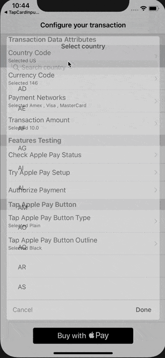

# TapApplePayKit-iOS

A SDK that provides an interface to show, process and authorize Pay in your app.

[](https://github.com/Tap-Payments/TapThemeManger-iOS)
[](https://img.shields.io/Tap-Payments/v/TapApplePayKit-iOS)




## Requirements

To use the SDK the following requirements must be met:

1. **Xcode 11.0** or newer
2. **Swift 4.2** or newer (preinstalled with Xcode)
3. Deployment target SDK for the app: **iOS 12.0** or later


## Installation

------

### Installation with CocoaPods

[CocoaPods](http://cocoapods.org/) is a dependency manager, which automates and simplifies the process of using 3rd-party libraries in your projects.
You can install it with the following command:

```
$ gem install cocoapods
```

### Podfile

To integrate goSellSDK into your Xcode project using CocoaPods, specify it in your `Podfile`:

```
platform :ios, '12.0'
use_frameworks!

source 'https://github.com/CocoaPods/Specs.git'

target 'MyApp' do
    
    pod 'TapApplePayKit-iOS'

end
```

Then, run the following command:

```
$ pod update
```


## Features

------

`TapApplePayKit` provides extensive ways for utilising Pay in your application with ease:

- Using Tap Apple Pay Button:

  - On the shelf customisble Apple pay button.
  - Handles Apple payment authorization and processing.
  - Theme and title are customisable.
  - 

- Using your UI:

  - You can start `TapApplePayKit`  from your own UI at the point you see convient.

  - Will handle Apple pay authorization.

  - Will delegate back the Apple Pay processing result.

    

  Making it one of the most inclusive pods in the market, yet one of the easiest to integrate with.

## Models

This section will descripe the models used within the kit. This is an important introduction to understand how to utilise and use the kit.


### TapApplePayPaymentNetwork

This an expressive enum to wrap PKPaymentNetwork. Following are the supported cases stating if any of them require a minimum iOS version

*Swift*:

```swift
case Amex
case CartesBancaires
case Discover
case Eftpos
case Electron
@available(iOS 12.1.1, *)
case Elo
case idCredit
case Interac
case JCB
@available(iOS 12.1.1, *)
case Mada
case Maestro
case MasterCard
case PrivateLabel
case QuicPay
case Suica
case Visa
case VPay

```


### TapApplePayStatus

This enum is a wrapper to indicate the current device/user status to deal with Apple Pay.

*Swift*:

```swift
 /// This means the current device/user has Apple pay activated and a card belongs to the given payment networks
    case Eligible
    /// This means the current device/user has Apple pay activated but has no card belongs to the given payment networks
    case NeedSetup
    /// This means the current device/user cannot use Apple pay from Apple
    case NotEligible
```


### TapApplePayButtonType

This enum is an expresive wrapper of PKPaymentButtonType to define the type/context of the TapApplePayButton, this will effect the title on the button

*Swift*:

```swift
 /// Title : Pay
    case AppleLogoOnly
 /// Title : Buy with Pay
    case BuyWithApplePay
 /// Title : Setup Pay
    case SetupApplePay
 /// Title : Pay with Pay
    case PayWithApplePay
 /// Title : Donate with Pay
    case DonateWithApplePay
 /// Title : Checkout with Pay
    case CheckoutWithApplePay
 /// Title : Book with Pay
    case BookWithApplePay
 /// Title : Subscribe with Pay
    case SubscribeWithApplePay
```


### TapApplePayButtonType

This enum is an expresive wrapper of PKPaymentButtonStyle to define the style of the TapApplePayButton

*Swift*:

```swift
 /// Full black with white title
    case Black
/// Full white with black title
    case White
/// Full white with black border and black title
    case WhiteOutline
```


### TapApplePayToken

A class to represent TapApplePayToken model. This wraps the PKPaymentToken and will be used in the DataSource for `TapApplePayKit` . 

Also, it converts the raw  PKPaymentToken data to string and json and are publically accessible.

*Swift*:

```swift
 /**
     Create TapApplePayToken object with an apple payment token
     - Parameter rawAppleToken: This is the raw apple token you want to wrap. All other representations will be converted automatically
     */
    public init(with rawAppleToken:PKPaymentToken)
```


### TapApplePayRequest

The class that represents the request details that identefies the transaction and to be filled by the datasource of `TapApplePayKit` .  The app will have to pass mandatory information to fulfil Pay requirements.


*Swift*:

```swift
/**
     Creates a Tap Apple Pay request that can be used afterards to make an apple pay request
     - Parameter countryCode: The country code where the user transacts default .US
     - Parameter currencyCode: The currency code the transaction has default .USD
     - Parameter paymentNetworks:  The payment networks you  want to limit the payment to default [.Amex,.Visa,.Mada,.MasterCard]
     - Parameter var paymentItems: What are the items you want to show in the apple pay sheet default  []
     - Parameter paymentAmount: The total amount you want to collect
     - Parameter merchantID: The apple pay merchant identefier default ""
     **/
    public func build(with countryCode:TapCountryCode = .US, paymentNetworks:[TapApplePayPaymentNetwork] = [.Amex,.Visa,.MasterCard], paymentItems:[PKPaymentSummaryItem] = [], paymentAmount:Double,currencyCode:TapCurrencyCode = .USD,merchantID:String)
```


## Controllers

This section descripes the actual controllers that your app will be dealing with. The controller is different based on the integration mode the app utilises. Whether using our TapApplePayButton or starting the kit from your own UI.


### TapApplePayButton

`TapApplePayKit` provides a from the shelf UIView that will show Apple Pay button to the user. The button will handle himself and will start and process Apple payment when clicked.

The button provides ways to customise its look and a datasource protocol to fill in the required data to start Apple pay process. Also it provides a delegate protocol to pass back to your app the parsed apple payment token when the user authorizes the payment.

*Datasource, Swift*:

```swift
/// Data source to provide needed data for the apple pay button to start the apple authorization process
@objc public protocol TapApplePayButtonDataSource {
    /// This s the Tap wrapper of Apple pay request and it is a must to be correctly filled before firing Apple pay request
    var tapApplePayRequest:TapApplePayRequest { get }
}
```

*Delegate, Swift*:

```swift
/// Delegate of methods Tap Apple Pay will use to pass back the results of the authorization process
@objc public protocol TapApplePayButtonDelegate {
    /**
     This method will be called once the authprization happened
     - Parameter appleToken: The correctly and authorized tokenized payment data from Apple Pay kit
     */
    func tapApplePayFinished(with tapAppleToken:TapApplePayToken)->()
}
```

After setting its frame as any normal UIView, you can setup it to provide a customised look as needed by your app as follows:

*Swift*:

```swift
/**
     Method to configure the tap apple pay button
     - Parameter tapApplePayButtonClicked: Inform when the apple pay button is clicked so you can do any logic if you want
     - Parameter buttonType: The type/title to show for the Apple pay button
		 - Parameter buttonStyle: The UI style you want to apply to the button
     */
    public func setup(tapApplePayButtonClicked:((TapApplePayButton)->())? = nil,buttonType:TapApplePayButtonType = .AppleLogoOnly, buttonStyle:TapApplePayButtonStyleOutline = .Black)
```

### TapApplePay

`TapApplePayKit` provides an interface to start the Apple pay authorisation process based on an event within your own UI.

Use this whenever you want to use your own UI and want to start apple pay process at a certain point of your app's flow. As easy as possible without the need for any datasource or delegates implementation using block based development.

To start the payment process with one line call as follows:

*Swift*:

```swift
/**
     Public interface to be used to start Apple pay athprization process without the need to include out Tap APple Pay button
     - Parameter presenter: The UIViewcontroller you want to show the native Apple Pay sheet in
     - Parameter tapApplePayRequest: The Tap apple request wrapper that has the valid data of your transaction
     - Parameter tokenized: The block to be called once the user successfully authorize the payment
     */
    public func authorizePayment(in presenter:UIViewController, for tapApplePayRequest:TapApplePayRequest, tokenized:@escaping ((TapApplePayToken)->()))

```


## Examples

### Starting the KIT from within your UI

*Swift*:

```swift
import TapApplePayKit_iOS
import enum CommonDataModelsKit_iOS.TapCountryCode
import enum CommonDataModelsKit_iOS.TapCurrencyCode

// Prepare the needed parameters, to adjust them once you need to start the process
let myTapApplePayRequest:TapApplePayRequest = .init()
let tapApplePay:TapApplePay = .init()

// Fill in the required data for your transaction to the TapApplePayRequest object
myTapApplePayRequest.build(with: .US, paymentNetworks: [.Amex,.Visa,.MasterCard], paymentItems: [PKPaymentSummaryItem(label: "My Best Seller", amount: 10)], paymentAmount: 10, currencyCode: .USD, merchantID:"merchant.tap.gosell")
// PS : you can use the default parameters and just pass the amount and merchant id as follows:
myTapApplePayRequest.build(paymentAmount: 10, merchantID: "merchant.tap.gosell")


// Then you can start the payment authorization process with one call whenever you. want as follows
tapApplePay.authorizePayment(in: self, for: myTapApplePayRequest) { [weak self] (token) in
	print("I can do whatever i want with the result token")
}
```


### Utilizing TapApplePayButton

*Swift*:

```swift
import TapApplePayKit_iOS
import enum CommonDataModelsKit_iOS.TapCountryCode
import enum CommonDataModelsKit_iOS.TapCurrencyCode

// Prepare the needed parameters, to adjust them once you need to start the process
let myTapApplePayRequest:TapApplePayRequest = .init()
let tapApplePay:TapApplePay = .init()
// Create the TapApplePayButton by providing the bounds if the uiview holder inside your layoutu
let tapApplePayButton = TapApplePayButton.init(frame: tapApplePayButtonHolder.bounds)

// Then we need to setup the button to provide the needed UI customisation, you can use the default or provide yours.

tapApplePayButton.setup(tapApplePayButtonClicked: { (clickedTapApplePayButton:TapApplePayButton) in
            print("A Tap apple pay button was clicked !")
        }, buttonType: .PayWithApplePay, buttonStyle: .Black)
// PS : You can use the default values and just call:
tapApplePayButton.setup()
// Add the Button to your UI
tapApplePayButtonHolder.addSubview(tapApplePayButton)

// Provide the data source and the delegate protocols
tapApplePayButton.dataSource = self
tapApplePayButton.delegate   = self


// Implement the delegates and the data sources needed methods
extension ViewController:TapApplePayButtonDataSource,TapApplePayButtonDelegate {
  // You have to return the TapApplePayRequest which we defined up, to start the apple pay process
    var tapApplePayRequest: TapApplePayRequest {
        return myTapApplePayRequest
    }
    
    func tapApplePayFinished(with tapAppleToken: TapApplePayToken) {
        print("I can do whatever i want with the result token")
    }
}
```

